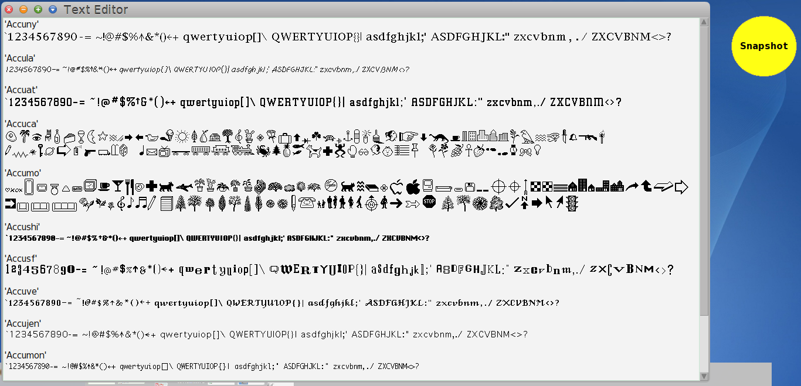

# SF2-Import
Import Squeak sf2 format (StrikeFont) files
============================
Tested in Cuis 5.0  rev 3000

To load the package
````Smalltalk
	Feature require: #'SF2-Import'.
````

You will need to unzip the AccuFonts.zip file.  

Also available via http://wiki.squeak.org/squeak/uploads/696/AccuFonts.zip

A good place for these fonts would be Cuis-Smalltalk-Dev/AdditionalFontData.
````Smalltalk
	SF2Installer readSF2FontsFromDir: 'AdditionalFontData'.

	"Something to look at"
	(StringMorph 
		contents: 'Some text in a particular font!' 
		font: (AbstractFont familyName: 'Accujen' aroundPointSize: 30))
		 openInHand.
````


